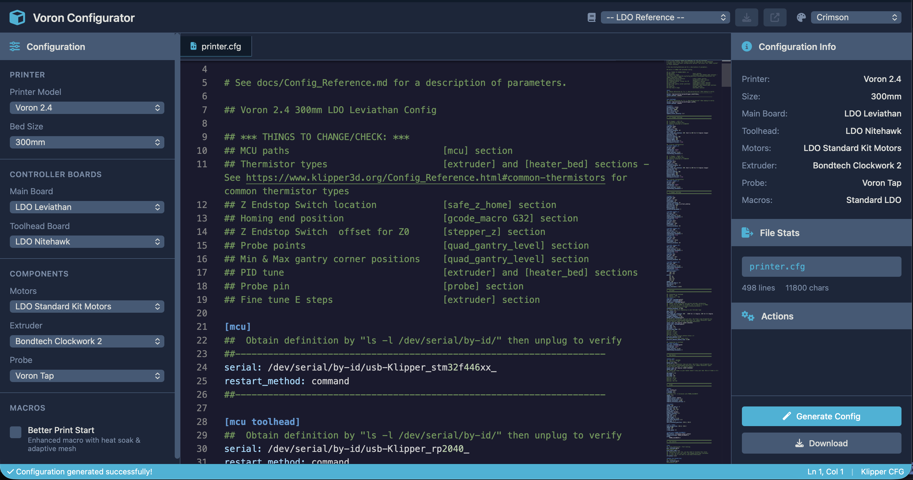

# Voron Configurator

A Flask-based web application for generating Klipper configuration files for Voron 3D printers, specifically designed for LDO kits.



## Features

### Core Configuration Generation
- **Multiple Printer Support**: Voron 2.4 and Voron Trident
- **Board Compatibility**: LDO Leviathan, BTT Octopus (v1/Pro), Spider v2.3, Manta M8P
- **Toolhead Boards**: LDO Nitehawk, EBB SB2209, EBB36
- **Motor Configurations**: LDO standard kits with proper current settings
- **Extruder Options**: G2E, Orbiter, Bondtech series, CW2
- **Probe Support**: Tap, Beacon, Klicky, and more

### LDO Reference Configs
- **Official LDO Configs**: Direct access to LDO's GitHub repository configs
- **Tabbed Interface**: Open reference configs in separate tabs
- **All Revisions Supported**:
  - Voron 2.4: Leviathan Rev D, Octopus Rev C/A
  - Trident: Leviathan Rev D, Octopus Rev C/A
- **Generate from Reference**: Create customized configs based on LDO references

### Advanced Features
- **Ace Editor**: Self-hosted editor with Mainsail-style syntax highlighting for Klipper configs
- **Theme Support**: Multiple color themes (Crimson, Forest, Nebula, Amber, Arctic, Voron)
- **Better Print Start**: Enhanced macros with chamber heat soak (Ellis-style)
- **Real-time Preview**: See configuration changes instantly
- **Download**: Export configs as printer.cfg

## Installation

### Prerequisites
- Python 3.9+
- pip or uv package manager

### Setup with pip
```bash
# Clone the repository
git clone <repository-url>
cd voron_configurator

# Create virtual environment
python -m venv .venv
source .venv/bin/activate  # On Windows: .venv\Scripts\activate

# Install dependencies
pip install flask

# Run the application
python app.py
```

### Setup with uv (recommended)
```bash
# Clone the repository
git clone <repository-url>
cd voron_configurator

# Install uv if not already installed
curl -LsSf https://astral.sh/uv/install.sh | sh

# Install dependencies
uv pip install flask

# Run the application
uv run python app.py
```

The server will start at http://localhost:3000

## Usage

### Generating a Configuration
1. Open http://localhost:3000 in your browser
2. Select your printer model (Voron 2.4 or Trident)
3. Choose bed size (250mm, 300mm, or 350mm)
4. Select your main board and toolhead board
5. Pick motor kit, extruder, and probe type
6. Click "Generate Config"
7. Download the generated printer.cfg

### Using LDO Reference Configs
1. Click the "LDO Refs" link in the top bar (with book icon)
2. Browse available reference configs on the LDO references page
3. Reference configs open in a separate page for easy viewing
4. Return to the main configurator to generate your customized config

### Switching Themes
Click the palette icon in the top right to switch between color themes.

## API Endpoints

### Generate Configuration
```http
POST /api/generate
Content-Type: application/json

{
  "printer": "voron2.4",
  "size": "300",
  "main_board": "leviathan",
  "toolhead_board": "nitehawk",
  "motors": "ldo",
  "probe": "tap",
  "print_start": "standard"
}
```

### Get LDO Reference Configs
```http
GET /api/reference-configs
```
Returns all available LDO reference configurations.

### Get Specific Reference Config
```http
GET /api/reference-config?printer=voron2.4&board=leviathan&revision=rev_d
```
Fetches the content of a specific LDO reference config from GitHub.

### Download Configuration
```http
POST /api/download
Content-Type: application/json

{
  "config": "<config content>",
  "filename": "printer.cfg"
}
```

## Configuration Data

### Main Boards
```python
MAIN_BOARDS = {
    'leviathan': {
        'name': 'LDO Leviathan',
        'mcu': 'stm32f446',
        # X/Y: TMC5160 (SPI), Z: TMC2209 (UART)
    },
    'octopus_v1': 'BTT Octopus v1.1',
    'octopus_pro': 'BTT Octopus Pro',
    'spider_v23': 'BTT Spider v2.3',
    'manta_m8p': 'BTT Manta M8P'
}
```

### LDO Reference Configs
The app fetches official LDO configs from:
- Voron 2.4: https://github.com/MotorDynamicsLab/LDOVoron2
- Trident: https://github.com/MotorDynamicsLab/LDOVoronTrident

## Project Structure

```
voron_configurator/
├── app.py                 # Main Flask application
├── templates/
│   ├── index.html         # Main web interface
│   └── ldo_references.html # LDO reference configs page
├── static/
│   ├── css/
│   │   └── style.css      # Application styles
│   └── js/
│       ├── app.js         # Frontend JavaScript
│       └── ace/           # Self-hosted Ace Editor
│           ├── ace.js                     # Main editor library
│           ├── mode-klipper.js            # Klipper syntax mode
│           ├── theme-mainsail.js          # Mainsail theme
│           ├── ext-language_tools.js      # Autocomplete support
│           └── theme-*.js                  # Other themes
├── tests/                 # Test suite
│   ├── conftest.py        # Test configuration
│   ├── test_api.py        # API tests
│   ├── test_ui.py         # UI tests
│   ├── test_right_pane_updates.py
│   ├── test_alphanumeric_highlighting.py
│   └── test_mainsail_theme.py
└── README.md              # This file
```

### Key Components

#### app.py
- **Flask Routes**: Main page, API endpoints
- **Configuration Data**: Printers, boards, motors, extruders, probes
- **Config Generation**: `generate_comprehensive_cfg()` creates printer.cfg content
- **Driver Detection**: Automatic TMC5160/TMC2209 selection based on board

#### app.js
- **VoronConfigurator Class**: Main application logic
- **Tab Management**: Create, switch, and close tabs
- **Ace Editor Integration**: Mainsail-style syntax highlighting for Klipper
- **Reference Config Handling**: Load LDO configs in separate tabs
- **Theme System**: All themes map to Mainsail dark theme

#### style.css
- **Theme System**: CSS variables for multiple color schemes
- **Responsive Layout**: Sidebar + editor + info panels
- **Tab Styling**: Active/inactive states, close buttons
- **Reference Tab Indicators**: Orange book icon styling

## Technical Details

### Board-Specific Configurations

#### LDO Leviathan
- **MCU**: STM32F446 (not H743!)
- **X/Y Drivers**: TMC5160 with SPI (HV steppers)
  - X: PB10/PB11/PG0, CS=PE15
  - Y: PF15/PF14/PE9, CS=PE11
  - SPI Bus: spi4
- **Z Drivers**: TMC2209 with UART
  - Z0: PD4/PD3/PD7, UART=PD5
  - Z1: PC12/PC11/PD2, UART=PD0
  - Z2: PC9/PC8/PC10, UART=PA8
  - Z3: PG7/PG6/PC7, UART=PG8
- **Heaters**: PG11 (bed), PG10 (extruder)
- **Fans**: PB7 (part), PB3 (hotend), PF7 (controller)
- **Endstops**: PC1 (X), PC2 (Y), PC3 (Z)

#### Other Boards
- Standard TMC2209 for all steppers
- UART communication
- Board-specific pin mappings in `MAIN_BOARDS` dictionary

### Klipper Config Format
The generated configs follow LDO's official format:
- Proper MCU configuration
- Correct pin mappings
- TMC driver settings (run_current, sense_resistor)
- Probe configuration
- Bed mesh settings
- Custom macros (PRINT_START, PRINT_END)

## Development

### Adding New Boards
1. Add entry to `MAIN_BOARDS` dictionary in `app.py`
2. Define pin mappings, MCU type, and driver types
3. Update `generate_xy_driver_config()` if special drivers needed

### Adding New LDO Reference Configs
Update `LDO_REFERENCE_CONFIGS` dictionary:
```python
LDO_REFERENCE_CONFIGS = {
    'voron2.4': {
        'leviathan': {
            'rev_d': {
                'name': 'Leviathan Rev D',
                'url': 'https://raw.githubusercontent.com/...',
                'description': 'Latest LDO Leviathan config'
            }
        }
    }
}
```

### Theme Development
Add new theme to `THEMES` dictionary:
```python
THEMES = {
    'new_theme': {
        'name': 'New Theme',
        'primary': '#color',
        'accent': '#color',
        # ... other colors
    }
}
```

## Testing

The project uses **pytest** with **Playwright** for comprehensive testing.

### Quick Test Run
```bash
# Run all tests
uv run pytest

# Run only API tests (fast)
uv run pytest tests/test_api.py -v

# Run UI tests (requires browser)
uv run pytest tests/test_ui.py -v --headed

# Or use the test runner script
./run_tests.sh
```

### Test Structure
```
tests/
├── conftest.py                     # Test configuration and fixtures
├── test_api.py                     # Backend API tests (12 tests)
├── test_ui.py                      # Frontend UI tests with Playwright
├── test_right_pane_updates.py      # Right pane info panel tests
├── test_alphanumeric_highlighting.py  # Syntax highlighting tests
└── test_mainsail_theme.py          # Theme color verification tests
```

### API Tests (Fast)
- Config generation for all printer types and boards
- Leviathan STM32F446 and pin verification
- LDO reference config endpoint validation
- Download functionality

### UI Tests (E2E)
- Page load and Ace Editor initialization
- Config generation updates editor
- LDO references page functionality
- Right pane info panel updates
- Syntax highlighting verification
- Theme color accuracy

See `tests/README.md` for detailed testing documentation.

## Troubleshooting

### Port Already in Use
```bash
# Find and kill existing process
lsof -i :3000
kill -9 <PID>
```

### Ace Editor Not Loading
Check browser console for errors. The app uses self-hosted Ace Editor files in `static/js/ace/`.

### Reference Config Not Loading
1. Check internet connection (fetches from GitHub)
2. Verify GitHub URLs in `LDO_REFERENCE_CONFIGS`
3. Check browser console for fetch errors

## License

GPL-3.0 License - Same as Voron Design and LDO Motors

## Credits

- **Voron Design Team**: For the amazing printer designs
- **LDO Motors**: For official kit configurations
- **Klipper3D**: For the firmware and config reference

## Support

For issues with the configurator:
- Open an issue on GitHub
- Check the browser console for error messages
- Verify your selections match your hardware

For printer support:
- Voron Discord: https://discord.gg/voron
- LDO Documentation: https://docs.ldomotors.com
